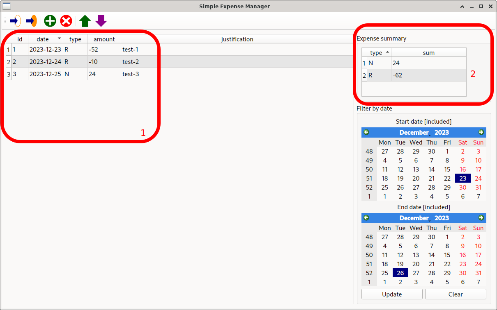

# Advanced operations

## Importing from CSV

We will import in an empty database the csv file displayed
below (notice how the `id` field is not necessary, and can be
left empty: it will be auto-filled by the program in this
case). If the database is not empty, the new data will be
appended to the existing ones.

In the background, we created an empty database as discussed in
the [basics](basic.md) session. In order to import the data,
we use the fifth button from the right (which will call a file
selection dialog from which the file to import can be
selected).

The results of the import are displayed below: all the imported
expenses (and the previously existing ones, if any) are
displayed in the database. By default, the ordering is by date,
descending (more recent expenses at the top).

The default ordering can be changed by pressing any of the
headers; clicking an already selected header (here, `date`)
will reverse ordering.

## Filtering and summarizing

Expenses can be filtered by selecting a window of interest.
This can be done by choosing the appropriate dates on the
control section on the right of the window, followed by
pressing the `Update` button.

Only the expenses within the selected dates (included) are
displayed (1). Furthermore, the sum of the amounts for each
category are displayed in the summary window on the right (2).

Imposed filters can be removed pressing the `Clear` button on
the bottom right of the screen.

## Exporting to CSV

We have added an expense to the database via the *Add* button,
as discussed in the [basics](basic.md) section. Note how the
added expense is always placed at the bottom of the table.

After filling in the fields, the expenses in the database
(including those not visualized, if any, and the newly added
one) can be exported to a CSV file using the sixth button from
the right.

The name for the export file will be selected through a file
selection window. The generated file will report all the
details of the expenses in the database, including the `id`
field:

