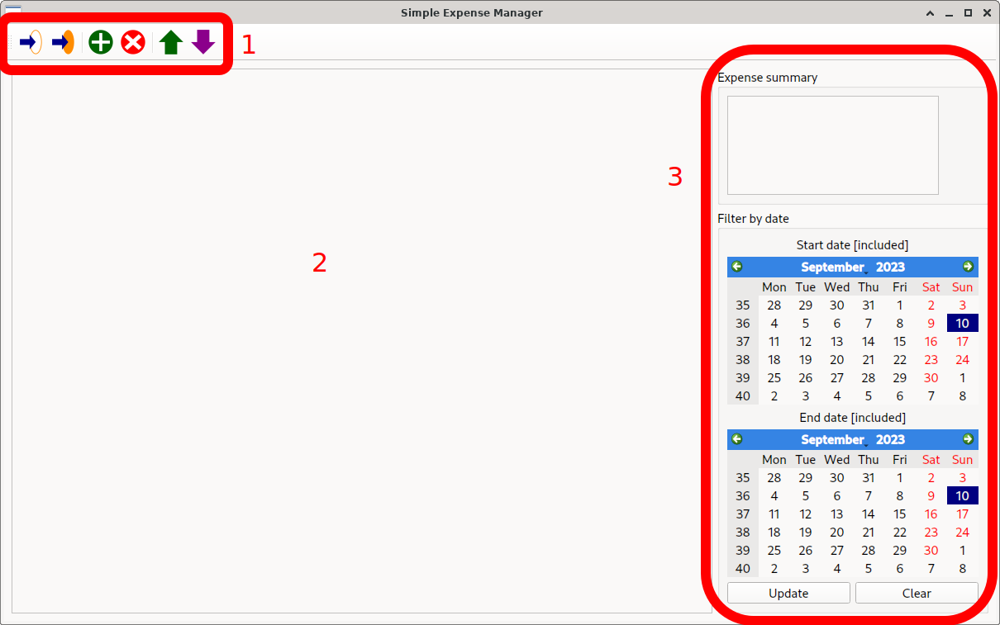
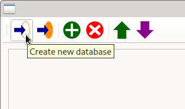
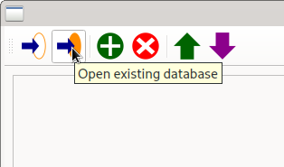
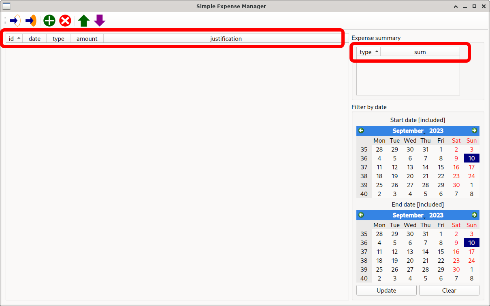
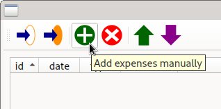
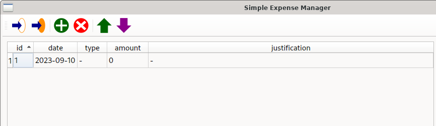
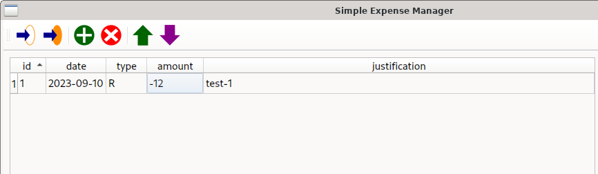
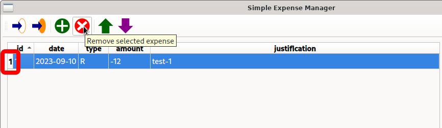

# Basic operations

## Creating and opening

The splash screen below is displayed when opening `sem`. On
different systems, icons and control positions will be the
same, although the controls may look slightly different.

- The toolbar at the top (1) allows to perform the necessary
  database actions.
- The main display below it (2) will display database content
  (i.e., expense data).
- The controls on the right (3) allow to filter displayed data
  and to gather overall information.

The topmost left buttons allow, respectively, to create a new
database with the correct table structure and to log in to an
existing one.

Both commands will open a file creation/selection dialog where
a new database can be created or an existing one opened. Once
accepted, the splash screen will slightly change, reporting the
headers of the database; for an empty one, it should look like
in the figure displayed below.

## Adding and removing

The third button from the left allows to add new expenses to
the database.

This will add a template expense in the table (and in the
database).

Double-clicking any of the fields allows to modify them, with
modifications being applied to the database as well.

The fourth button from the left allows to remove expenses; to
select an expense for removal, its entire row should be
selected (this can be achieved by pressing the bumper to the
left of the `id` field, marked below).

The removal of an expense is also immediately committed to the
database.
